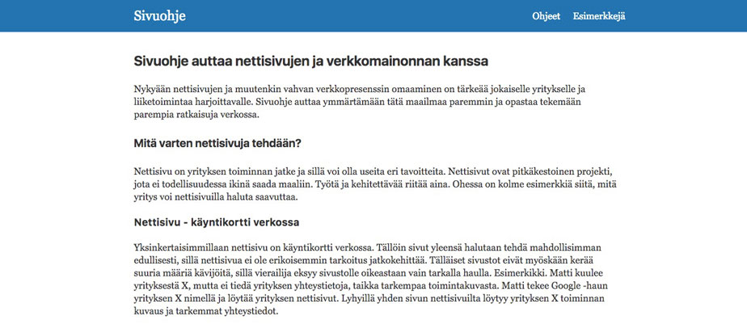

Sivuohje tarjoaa informaatiota nettisivuista ja verkkomainonnasta. Nykyään nettisivujen ja muutenkin vahvan verkkopresenssin omaaminen on tärkeää jokaiselle yritykselle ja liiketoimintaa harjoittavalle. Sivuohje auttaa ymmärtämään tätä maailmaa paremmin ja opastaa tekemään parempia ratkaisuja verkossa. 

## Mitä varten nettisivuja tehdään?

Nettisivu on yrityksen toiminnan jatke ja sillä voi olla useita eri tavoitteita. Nettisivut ovat pitkäkestoinen projekti, jota ei todellisuudessa ikinä saada maaliin. Työtä ja kehitettävää riitää aina. Ohessa on kolme esimerkkiä siitä, mitä yritys voi nettisivuilla haluta saavuttaa. 

### Nettisivu - käyntikortti verkossa

Yksinkertaisimmillaan nettisivu on käyntikortti verkossa. Tällöin sivut yleensä halutaan tehdä mahdollisimman edullisesti, sillä nettisivua ei ole erikoisemmin tarkoitus jatkokehittää. Tälläiset sivustot eivät myöskään kerää suuria määriä kävijöitä, sillä vierailija eksyy sivustolle oikeastaan vain tarkalla haulla. Esimerkikki. Matti kuulee yrityksestä X, mutta ei tiedä yrityksen yhteystietoja, taikka tarkempaa toimintakuvasta. Matti tekee Google -haun yrityksen X nimellä ja löytää yrityksen nettisivut. Lyhyillä yhden sivun nettisivuilta löytyy yrityksen X toiminnan kuvaus ja tarkemmat yhteystiedot.

Tämä tuntuu valitettavan usein olevan suomalaisten verkkosivujen toimintamalli, vaikkakin tämä ei välttämättä ollut sivujen ensisijainen tarkoitus. Välillä tavoitteet voivat olla suuria, mutta tähän tilanteeseen päädytään sillä, että resursseja ei yksinkertaisesti käytetä verkkoon. Useimmiten tälläisten sivustojen kävijämäärät ovat hyvin pieniä tai jopa lähes olemattomia. Tämä tietenkin riippuu siitä, kuinka suosittu yritys tai toiminta jo on. 

### Nettisivu - asiakastiedon kerääminen verkosta

Tässä mallissa nettisivuilla haetaan jo jotain tuloksia. Asiakastiedon, eli liidien kerääminen voidaan toteuttaa monella tavalla. Esimerkiksi rekrytointiin keskittynyt yritys voidaan nähdä tälläisenä nettisivuna. Rekrytointi yritykset välittävät muille yrityksille työntekijöitä ja tarvitsevat omaan rekisteriinsä mahdollisimman paljon potentiaalisia työntekijöitä. He ilmoittavat sivustollaan työpaikasta ja antavat nettisvivulla vierailevalle mahdollisuuden hakea paikkaan jättämällä oman ansioluettolonsa rekrytointi yritykselle. Kun tämä tapahtuma on suoritettu, on rekrytointi yrityksen maali (goal) saavutettu ja yrityksellä on yksi liidi lisää rekisterissä. 

Tämä on vain yksi esimerkki liidien keräämisestä ja erilaisia malleja voi olla useita. Yksinkertaisimmillaan sähköposti voi olla ainoa mitä vierailijoista halutaan saada irti. Tämä voidaan toteuttaa esimerkiksi järjestämällä arvonta verkossa. Arvontaan osallistuminen edellyttää voimassa olevan sähköpostin jättämistä. Arvonta itsessään voi olla todellinen, ja voittajaa kontaktoidaan sähköpostilla, mutta arvonnan ehdoissa osallistuja suostuu siihen, että hänen jättämää sähköpostia saadaan käyttää miten tahansa. Useimmiten nämä sähköpostit myydään isoina listoina eteenpäin erilaisille postittajille. 

### Nettisivu - kauppapaikka verkossa

Kolmas yleinen nettisivujen tarkoitus on toimia kauppapaikkana verkossa. Tämä toimintamalli voi kahden aikaisemman ohella vaihdella koon perusteella hyvinkin paljon. Yksinkertaisimmillaan tavoite voi olla yhden tuotteen myyminen. Esimerkiksi kirjailija on julkaissut uuden kirjan ja myy kirjaa myös omien sivujensa kautta. Mitä pienemmästä tämän aloittaa, sitä helpompi pakettia on pitää kasassa toiminnan kasvaessa. 

Kauppapaikka verkossa ei myöskään tarkoita aina sitä, että verkkosivuston ylläpitäjä omistaa mitään fyysisiä tuotteita itse. Airbnb on esimerkiksi sivusto, joka välittää / myy ihmisille mahdollisuuden johonkin, jota he eivät itse omista. He vain tarjoavat alustan kauppatapahtumalle ja hoitavat transaktion.

## Tarvitseeko jokainen yritys nettisivut heti?

Toimintaansa aloittava yritys ei välttämättä tarvitse massiivisia sivuja heti, mutta domain on hyvä aina varata mahdollisimman pian. Helsingin IFK:lle tässä oli käydä huonosti kun <a href="http://www.is.fi/sm-liiga/art-2000000558624.html" target="_blank">tärkeät 12 euroa unohtui</a>.

Mikäli toiminta on erittäin pientä, voi erilaisia muita, kolmannen osapuolen palveluita käyttää hyväksi. Yhtä tuotetta varten ei ole pakko perustaa vielä verkkokauppaa. Kun toiminta, kasvaa on verkkosivuille ehdottomasti tarvetta. 

_Mahdollisuus_
_Google ja Youbtube ovat maailman suurimmat hakukoneet, voi esimerkiksi aluksi varmistaa, että yrityksesi löytyy kartalta ja alkaa tekemään mainosvideoita Youtuben välityksellä._

### Miksi julkaisunopeus on kuitenkin tärkeää?
Koska uusista nettisivuista ei automaattisesti koko maailmaa tiedoteta, on niiden ylös saanti mahdollisimman nopeasti erittäin hyödyllistä. Mitä nopeammin verkossa on edes jotain, sitä nopeammin hakukoneet tietävät sivuston olemassaolosta. Sivuohje -nettisivu esimerkiksi julkaistiin 24 tunnin sisällä ideasta ja ensimmäinen versio näytti seuraavalta:

<figure>

<figcaption>Sivuohje - ensimmäinen julkinen versio</figcaption>
</figure>

#### Nopeasti julkaistu ei tarkoita huonoa laatua
Nopeasti julkaistu verkkosivu ei tarkoita sitä, että tuote olisi huono. Päinvastoin se vaatii tiimiltä enemmän. Nettisivua on pystyttävä kehittämään koko ajan turvallisessa ympäristössä, missä uusia ominaisuuksia voidaan huoletta kokeilla ennen niiden viemistä julkiseksi. Sivuohje -nettisivua kehitetään aina ensin erillisessä testiympäristössä.